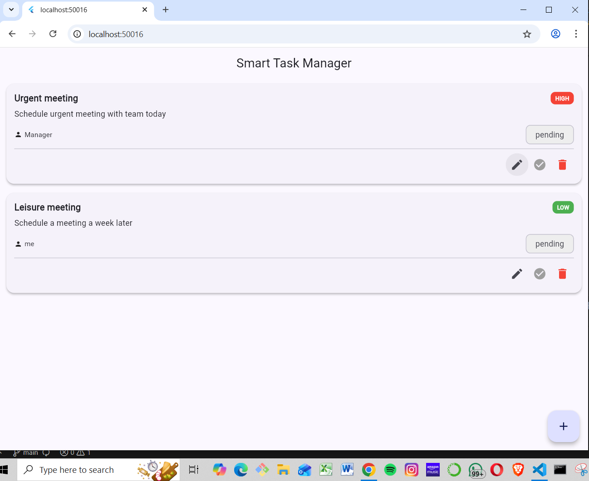
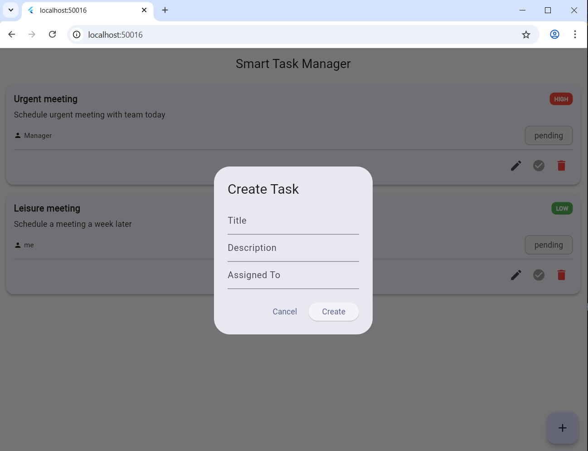
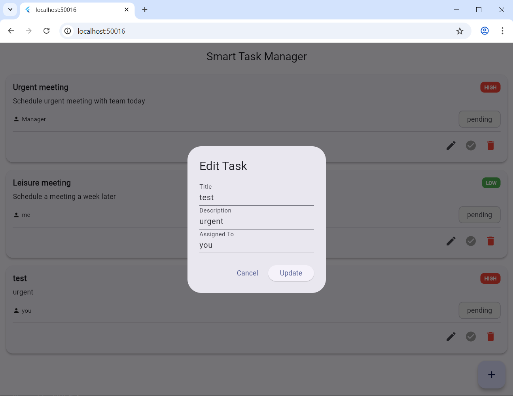

# Smart Task Manager 

Live API URL:
https://smart-task-manager-api-pvlf.onrender.com

---

## 1. Project Overview

Smart Task Manager is a full-stack intelligent task management system designed to automatically analyze task descriptions and enrich them with meaningful metadata.

When a user creates a task, the system automatically:
- Detects the task category (e.g., Scheduling, General)
- Assigns priority (High/Low) based on urgency keywords
- Extracts relevant entities from the text
- Suggests actionable next steps

Example:
User input:
"Schedule urgent meeting with team today about budget allocation"

System output:
- Category: Scheduling
- Priority: High
- Extracted entities: team, budget
- Suggested actions: Block calendar, Send invite, Prepare agenda

This project demonstrates real-world backend API design, clean database modeling, Flutter frontend integration, automated testing, and live deployment.

---

## 2. Tech Stack

Backend:
- Python 3.13
- FastAPI
- SQLAlchemy
- PostgreSQL (Supabase)
- Pydantic
- Pytest
- Render.com

Frontend:
- Flutter
- Dart
- Material UI
- HTTP package

---

## 3. Setup Instructions

Backend (Local Setup):

cd backend  
python -m venv venv  
venv\Scripts\activate  
pip install -r requirements.txt  
uvicorn app.main:app --reload  

Backend runs locally at:
http://127.0.0.1:8000

Frontend (Flutter):

cd smart_task_manager_frontend  
flutter pub get  
flutter run -d chrome  

---

## 4. API Documentation

Base Path:
/api/tasks

Create Task  
POST /api/tasks

Request Body:
{
  "title": "Urgent meeting",
  "description": "Schedule urgent meeting with team today",
  "assigned_to": "Manager"
}

List Tasks  
GET /api/tasks

Optional Filters:
?status=pending  
?status=completed  
?priority=high  
?category=scheduling  

Update Task  
PATCH /api/tasks/{task_id}

Request Body:
{
  "status": "completed"
}

Delete Task  
DELETE /api/tasks/{task_id}

---

## 5. Database Schema

Task Table:
- id (UUID)
- title (String)
- description (Text)
- category (String)
- priority (String)
- status (String)
- assigned_to (String)
- due_date (Timestamp, nullable)
- created_at (Timestamp)
- updated_at (Timestamp)

TaskHistory Table:
- id (UUID)
- task_id (UUID)
- action (String)
- old_value (JSON)
- new_value (JSON)
- changed_at (Timestamp)

---
##  Screenshots

### Flutter Dashboard

### Create Task

### Edit Task

### Task Completed

### Backend API Documentation

---

## 7. Architecture Decisions

- FastAPI chosen for speed, automatic validation, and OpenAPI documentation
- PostgreSQL used for reliable relational data storage
- TaskHistory table added for audit and change tracking
- PATCH used for partial updates (status, edits)
- Flutter used for a single, clean cross-platform UI
- Clear separation of concerns: routes, models, schemas, services

---

## 8. What I’d Improve With More Time

- User authentication and authorization
- Role-based task access
- Advanced filtering and search in UI
- Due dates and reminders
- Better NLP-based entity extraction
- Pagination and caching
- CI/CD pipeline with automated deployments

---

## 9. Testing

Implemented using Pytest:
- Test task creation
- Test task status update
- Test task deletion

Run tests with:
pytest

---

## Final Notes

This project reflects a production-style approach with clean APIs, database integrity, frontend usability, automated testing, and live deployment.

